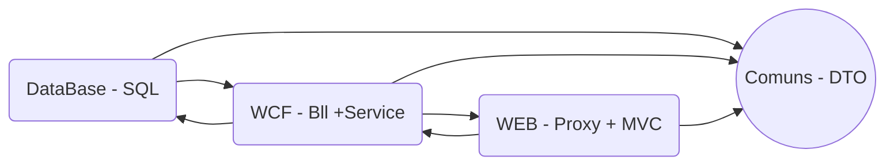

# Arquitetura em WCF - Service e MCV 

**Desenho das camadas da arquitetura**




### **Camada WEB** 
 > MVC  **design patterns** de modelo de aplicação web. Adicionamos as ferramentas WEB como o javascript, html, ajax ...
 
 > Proxy Consumimos os serviços/API que iremos utiliar

### **Camada WCF**
> Bll é a camada de negocio(business) onde trabalhamos as variaveis (entity), interface, classe, conexão com o banco (data.interface / data.nhibernate), dal, bll, injecao

> WCF - Windows Communication Foundation FrameWork que permite a criação de serviços web

### **Camada Commons** 
> Dentro da camada common adicionamos as classe que seram referenciadas por todos os outros projetos como os DTO (data transfer object), responsaveis por transitar os dados entre as camadas.
NAO PASSAMOS ENTIDADE PARA TELA E SIM DTO

### **ORDEM INICIO APP WEB**
1. Controller: Incia aplicação por padrão pelo Index
2. View: Tras a pagina com html, css...
3. Controller: o html chama uma API pelo controller e ele repassa
4. Model: aqui tratamos os dados 
5. Controller: devolve oque o view pediu
6. View: exibe oque recebeu do controller
``` html
<a onclick="Evento();" id="Unico" href="~/Controller">Link</a>
```
-    - Esse "Controller" dentro de "href" aponta para um cshtml dentro do "View" "**_return View("NOME");_** " aqui temos o nome do arquivo cshtml sem precisar da extensao

# Passo a Passo       

### Criando uma consulta de Usuário no Schema (módulo) Acesso


### **Comunns.Business.Dto**

##### **- Primeiro Criamos os DTOs que usaremos neste processo**
>UsuarioPesquisaDTO que tera os filtros que o user seleiconar na tela.
>UsuarioDTo que trará os dados completos dos usuários pesquisados. 

``` c#
public class UsuarioDto  
{  
	public int IdUsuario { get; set; }  
	public string LoginUsuario { get; set; }  
	public string NomePessoa { get; set; }  
}
```

``` c#
public class UsuarioPesquisaDto  
{  
	public string LoginUsuario { get; set; }  
	public string NomePessoa { get; set; }  
}
```

---
### **WCF.Business.Entity**
#### **Criando as entidades semelhante as do banco**


> Salvamos as tabelas presentes no banco que usamos, As **_foreign key_** devem ser criadas em outra _Entity_ para serem instancidas, Primeira letra maiuscula, adiciona o _{ get; set; }_ e adicionar _**virtual**_ para funcionar com as transacoes WEB
``` c#
public class Usuario  
{  
	// primary key  
	public virtual int IdUsuario { get; set; }  
	public virtual string Senha { get; set; }  
	public virtual string Login { get; set; }  
	public virtual int CodigoSAP { get; set; }  
	// foreign key  
	public virtual Pessoa.Pessoa Pessoa { get; set; }  
}
```

### **WCF.DataInterface**
> Atribuimos os metodos do Entity que vao rodar no banco.  
- **Acesslayer/SCHEMA**
> Camada de acesso de dados (faz as coneccoes com o banco), ja recebe as variaveis criadas no Entity mapeadas pelo NHibernete
``` c#
public interface IUsuarioDal : IDalHelper<Usuario>
    {
        Usuario PesquisarPorId(int id);
    }
```

### **WCF.NHibernate**
 - **AcessLayer/SCHEMA**
 > Aqui criamos o Dal que ira fazer as buscas dentro do Banco mais tarde quando instanciarmos ele no Bussiness
``` c#
public class UsuarioDal : DalHelper<Usuario>, IUsuarioDal
{
        public Business.Entity.Acesso.Usuario PesquisarPorId(int id)
        {
            return Pesquisar().Where(p => p.Id.Value.Equals(id)).FirstOrDefault();// p
        }
}
```
- **Maps/SCHEMA**  
> Aqui apresentamos para o **Entity** para nossas tabelas no banco
**ATENÇÃO:** Quando fazemos referência de outra tabela como lista nao podemos usar o LIST mas sim o **ILIST**

``` c#
// EX: Maps
using FluentNHibernate.Mapping;

 public class UsuarioMap : ClassMap<Usuario>
 {
    public UsuarioMap()
    {
        this.Schema("acesso"); //nome do schema

        this.Table("Usuario"); //nome da tabela

        this.Id(x => x.Id)//primary key
            .Column("Id_Usuario")//coluna
            .GeneratedBy 
            .Sequence("SeqUsuario");// sequences

        this.References(x => x.Pessoa) //usado para foreign key
            .Column("Id_Pessoa")
            .Not
            .Nullable();

        this.Map(x => x.LoginUsuario) //mapeia uma coluna
            .Column("Login_Usuario")
            .Length(255)
            .Not
            .Nullable();
	    	
    }
}
```

### **WCF.BusinessInterface**
- **SCHEMA** 
> Aqui adicionamos os metodos que vao tratar os dados (REGRA DE NEGOCIO)
```c#
public interface IUsuarioBll
    {
        IList<UsuarioListaDto> Pesquisar(UsuarioPesquisaDto dtoPesquisa);
    }
```

### **WCF.Business**
- **SCHEMA** 
> Aqui adicionamos os metodos que vao tratar os dados (REGRA DE NEGOCIO)
```c#
public class UsuarioBll : IUsuarioBll
    {
        [Inject]
        public IUsuarioDal UsuarioDal { get; set; }

        public IList<UsuarioListaDto> Pesquisar(UsuarioPesquisaDto dtoPesquisa)
        {
            IList<UsuarioListaDto> retorno = new List<UsuarioListaDto>();
            // CODIGO REGRA
            //Criar Conversor
			
			if (String.IsNullOrEmpty(dtoPesquisa.NomePessoa) & String.IsNullOrEmpty(dtoPesquisa.LoginUsuario))  
				retorno = UsuarioDal.Pesquisar()  
					.Select(u => new 	ConversorUsuario().ConverterPesquisa(u))
					.ToList();
 
			else if (String.IsNullOrEmpty(dtoPesquisa.NomePessoa))  
				retorno = UsuarioDal.Pesquisar()  
					.Where(u => u.Login == dtoPesquisa.LoginUsuario)  
					.Select(u => new ConversorUsuario().ConverterPesquisa(u))	
					.ToList();  
			else  
				retorno = UsuarioDal.Pesquisar()  
						.Where(u => u.Pessoa.Nome == dtoPesquisa.NomePessoa)  
						.Select(u => new ConversorUsuario().ConverterPesquisa(u))
						.ToList();

            return retorno;
        }
    }
```


### **WCF.ServicesInjecaoDependencia**
- **Modules/Business:** 
> Adicionamos os dal
```C#
    public class AcessoBusinessModule : NinjectModule
    {
        public override void Load()
        {
            Bind<IUsuarioDal>().To<UsuarioDal>();
            Bind<IDalHelper<Usuario>>().To<DalHelper<Usuario>>();
        }
    }
```
-  **Modules/WCF:**
> Adicionamos os bll
``` C#
public class AcessoServiceModule : NinjectModule
    {
        public override void Load()
        {
            Bind<IUsuarioBll>().To<UsuarioBll>();
        }
    }
```
- **InfraestrutureSetup** 
> Aqui adicionamos no Ninject os atalhos para os _"DAL"_ 
``` c#
public class InfrastructureSetup
    {
        public static void RegisterServices(StandardKernel kernel)
        {
            // WCF
            kernel.Load<AcessoServiceModule>();        
            
            // Bussiness
            kernel.Load<AcessoBusinessModule>();    
        }
    }
```

### **WCF.Services:**
> Aqui chamamos os métodos da camada de negocio costumamos colocar os mesmos metodos e nomes que na BLL.

>  Adicionamos um novo Serviço ao projeto em o **"WCF Service"**, criamos a pasta do Schema,  e adicionamos novo item WCF Service, com o nome UsuarioService.svc

***LEMBRE-SE QUE PARA ADICIONAR O WCF SERVICE TEMOS QUE COMENTAR O _ninject_ DENTRO DO  Web.config DO Services***


```c#
// Interface
[ServiceContract]
	public interface IUsuarioService
	{
        [OperationContract]
       IList<UsuarioListaDto> Pesquisar(UsuarioPesquisaDto dtoPesquisa);				
 }
```
``` c#
[ServiceBehavior(InstanceContextMode = InstanceContextMode.PerCall)]
[NHibernateContext]
public class NomeService : INomeService
{
    [Inject]
    public IUsuarioBll usuarioBll { get; set; }

    public IList<UsuarioListaDto> Pesquisar(UsuarioPesquisaDto dtoPesquisa)
    {
        return this.usuarioBll.Pesquisar(dtoPesquisa);
    }
}
```

### **WEB.Reference**  

> Primeiro adicionamos a referencia do serviço no Projeto proxy em Service Reference com o nome Schema.NomeService (Acesso.UsuarioService)
> Depois no app.Config trocamos o bindingConfiguration para "basicHttp" que é o nosso bind padrão.

### **WEB.Proxy**
- **Caminho:** SCHEMA
> Aqui herdamos os metodos do Serviço, orbigatorio adicionar o static para nao instanciar

```c#
public static IList<UsuarioDto> Pesquisar(int dtoPesquisa)
        {
            IList<UsuarioDto> retorno = new IList<UsuarioDto>();
            IList<UsuarioDto> client = null;

            try
            {
                client = new UsuarioServiceClient();
                retorno = client.PesquisarId(dtoPesquisa);
            }
            finally
            {
                if (client.State == System.ServiceModel.CommunicationState.Faulted)
                {
                    client.Abort();
                }
                else
                {
                    client.Close();
                }
            }

            return retorno;
        }
```
- **Proxy/app.config >> Web/web.config**: entramos no app.config e copiamos o cliente/endpoint e depois adicionamos no web.config dentro de client
``` c#
// Proxy/app.config
...
<endpoint address="http://localhost:8080/Acesso/UsuarioService.svc"
                binding="basicHttpBinding" bindingConfiguration="basicHttp"
                contract="Acesso.UsuarioService.IUsuarioService" name="BasicHttpBinding_IUsuarioService" />
...
```
```C#
// WEB/web.config
...
<endpoint address="http://localhost:8080/Acesso/UsuarioService.svc"  behaviorConfiguration="infoBehavior" binding="basicHttpBinding" bindingConfiguration="basicHttp" contract="Acesso.UsuarioService.IUsuarioService" name="BasicHttpBinding_IUsuarioService" />
...
```

### **WEB.Pages.Controllers** 
- **Controllers/SCHEMA/NomeController.cs**
> Aqui criamos os metodos que vao ser usados pelo front
```c#
public JsonResult Pesquisar(UsuarioPesquisaDto dtoPesquisa)
        {
            IList<UsuarioListaDto> dto = UsuarioProxy.Pesquisar(dtoPesquisa);
            return new JsonResult()
            {
                Data = new
                {
                    dto
                },
                JsonRequestBehavior = JsonRequestBehavior.AllowGet,
                MaxJsonLength = int.MaxValue
            };
        }
```

### **WEB.Pages.Views**
- **Caminho front:** Views/Usuario/Consulta.cshtml
- - **Caminho model:** Model/Acesso/UsuarioConsultaViewModel.cs
- **Caminho javascript:** Script/adicional/acesso/usuario.js
> o front (cshtml) chama um javascript que por sua vez acessa o _Controller_ para enviar os dados por **Ajax** e depois receber eles em formato Json
```html
<!-- Adiciona o caminho do javascript para executar-->
<script src="~/Scripts/adicional/acesso/usuario.js"></script>
```
``` html
<!-- Usei um botao para exemplificar como iriamos chamar o metodo   -->
<div class="div-botao">
    <button type="button" class="btn btn-primary" onclick="usuario.pesquisar(); return false;">Pesquisar</button>
</div>
```
``` javascript
var pesquisar = function () {
    $.ajax({
                type: "POST",
                url: base_path + "Usuario/Pesquisar", //caminho do controller
                data: { // dados
                    'dtoPesquisa': getFiltros() //outro metodo que usa os id do html para apontar os inputs com dados
                },
                cache: false,
                complete: function (XMLHttpRequest, textStatus) {
                }
            }).done(function (data) {
                // adiciona function para mostrar os dados ou devolver um popup com o ok
            }).fail(function (XMLHttpRequest, textStatus, errorThrown) {
                // adiciona function que devolve um popup com o erro
            });
}
```

